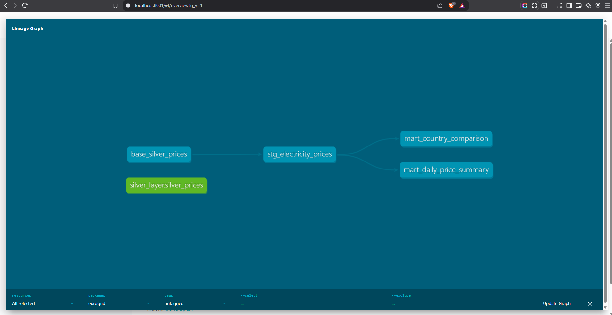

# EuroGrid Energy Intelligence Lakehouse


## What this project does

A production-grade data engineering pipeline that ingests real-time European 
electricity market data from the ENTSO-E Transparency Platform — covering 
Belgium, Germany, France, and the Netherlands.

The pipeline detects negative electricity prices (when renewables overproduce),
tracks cross-border price spreads, and delivers daily market summaries to 
a Power BI dashboard used for energy market analysis.

## Technical Architecture

The project implements a Medallion Architecture using a modern data stack:



1. **Ingestion**: Python/Airflow (Bronze)
2. **Processing**: PySpark (Silver)
3. **Modeling**: dbt & DuckDB (Gold)

```
ENTSO-E API → [Airflow DAG] → Bronze Layer → [PySpark] → Silver Layer → [dbt] → Gold Layer → Power BI
                (daily 07:00)   (raw Parquet)              (clean Parquet)        (DuckDB)
```

## Tech Stack

| Layer | Technology |
|-------|-----------|
| Ingestion | Python, entsoe-py |
| Orchestration | Apache Airflow 2.8 |
| Processing | PySpark 3.5, Delta Lake |
| Transformation | dbt-core 1.7, DuckDB |
| Data Quality | Great Expectations |
| Infrastructure | Docker, GitHub Actions |
| Visualisation | Power BI |

## Quick Start (3 commands)

```bash
git clone https://github.com/yourusername/eurogrid-energy-lakehouse.git
cd eurogrid-energy-lakehouse
cp .env.example .env  # add your ENTSO-E API key
docker-compose up -d  # starts Airflow at localhost:8080
```

## Key findings

- Belgium had X hours of negative electricity prices in [period]
- German prices were consistently Y EUR/MWh higher than French on weekdays
- Solar overproduction events (negative prices) cluster between 11:00-15:00 UTC

## Project structure

```
├── ingestion/      Python ENTSO-E API client
├── transform/      PySpark Silver transformation jobs
├── dags/           Apache Airflow DAG definitions  
├── dbt_project/    dbt Gold models (staging + marts)
├── tests/          Data quality tests
└── docs/           Architecture diagrams
```


## Author

Muhammad Ghouri — MSc Data Science, Hasselt University  
[LinkedIn](https://linkedin.com/in/muhammadghouri) | [Email](mailto:shahmir.ghouri99@gmail.com)
